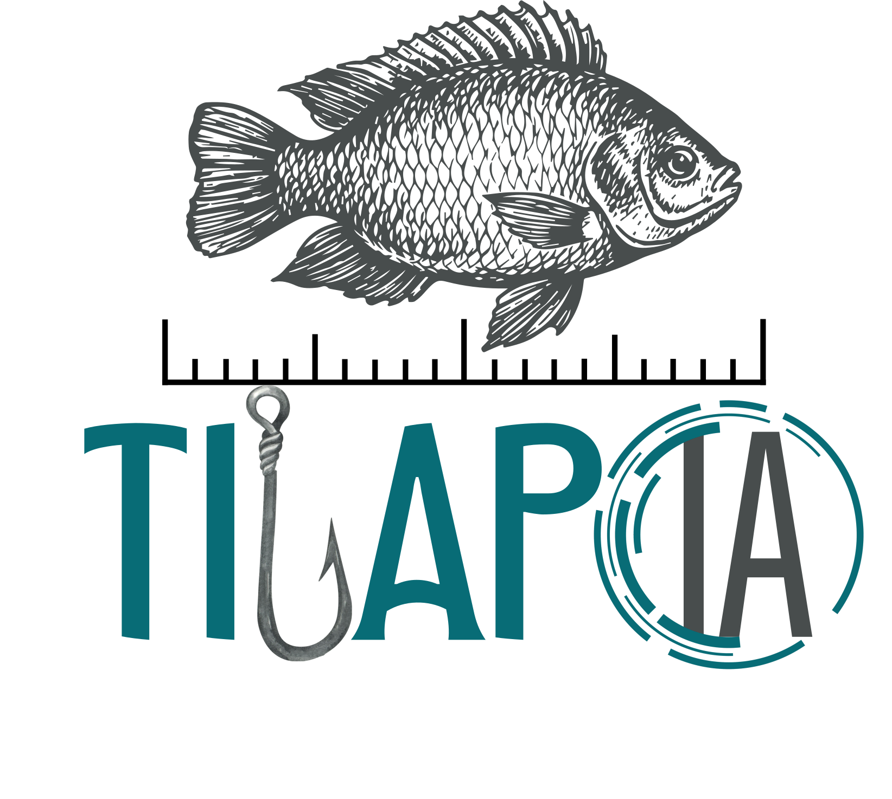
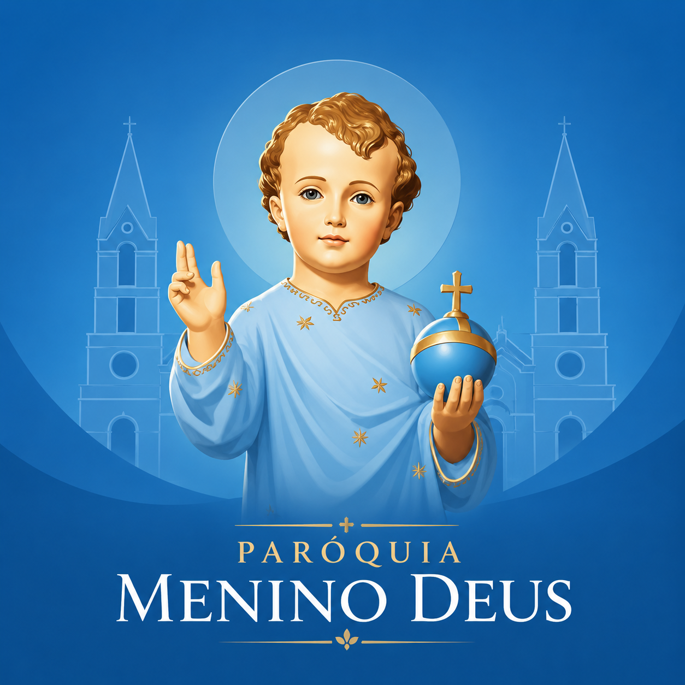

### Olá, mundo! 👋

Sou Pedro Miguel, estudante de Engenharia de Computação na UTFPR.

Atualmente, meu foco está em Python, inteligência artificial, automação de processos e desenvolvimento de agentes de IA. Tenho trabalhado com soluções que utilizam LLMs, RAG, FastAPI e fluxos multiagentes, buscando automatizar tarefas repetitivas, integrar sistemas e transformar conhecimento técnico em aplicações úteis.

Também possuo experiência prática com desenvolvimento web, back-end em C# e ASP.NET Core, front-end com React, bancos de dados relacionais e projetos envolvendo análise de dados, dashboards e visão computacional.

  <a href="https://pedrogattosch.vercel.app/">Portfólio</a> •
  <a href="https://pedrogattosch.hashnode.dev/">Blog</a> •
  <a href="https://instagram.com/pedrogattosch">Instagram</a> •
  <a href="https://linkedin.com/in/pedrogattosch">LinkedIn</a>

## Projetos

### TilapIA

🏆 Projeto campeão do Start Farm 2026

<table>
  <tr>
    <td width="160" align="center" valign="middle">
      
    </td>
    <td valign="middle">
      <a href="https://start-farm.vercel.app/">TilapIA</a> é uma solução voltada à biometria aquícola para piscicultura, com o objetivo de apoiar produtores no monitoramento estimado de tilápias. O projeto busca reunir informações como peso médio, qualidade da água, ração recomendada e previsão de abate em uma interface acessível para auxiliar na tomada de decisão. A proposta é reduzir a dependência da biometria manual, que exige a captura dos peixes, e abrir caminho para uma solução futura com câmera subaquática, sensores e visão computacional aplicada ao manejo aquícola.
    </td>
  </tr>
</table>

### Aplicativo Paróquia Menino Deus

🏗️ Projeto em desenvolvimento...

<table>
  <tr>
    <td width="160" align="center" valign="middle">
      
    </td>
    <td valign="middle">
      <a href="https://github.com/pedrogattosch/paroquia-app">Aplicativo Paróquia Menino Deus</a> é voltado para aproximar a comunidade paroquial, centralizando informações importantes como avisos, horários de missas, eventos, pastorais e conteúdos informativos em uma interface simples e acessível. O objetivo do projeto é facilitar a comunicação entre a paróquia e os fiéis, tornando o acesso às informações mais rápido, organizado e prático.
    </td>
  </tr>
</table>

 

## Habilidades

**IA e automação:** Python, FastAPI, LLM, RAG, agentes de IA, fluxos multiagentes, automação de processos, integração com APIs

**Front-end:** React, TypeScript, JavaScript, HTML, CSS, Tailwind CSS, Vite

**Back-end:** C#, .NET, ASP.NET Core, Entity Framework Core, JWT, API REST, xUnit

**Dados e visão computacional:** Pandas, NumPy, Matplotlib, OpenCV, Dash

**Banco de dados:** SQL Server, SQLite

**Mobile:** Flutter, Dart

**Ferramentas:** Git, GitHub, GitLab, Docker, Postman, Swagger, Figma, Codex, Claude Code
